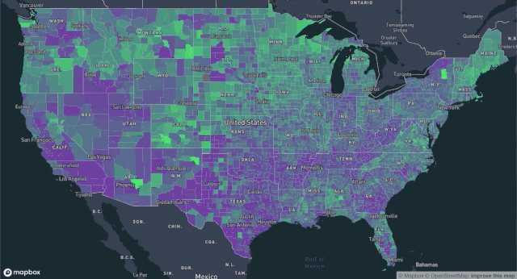
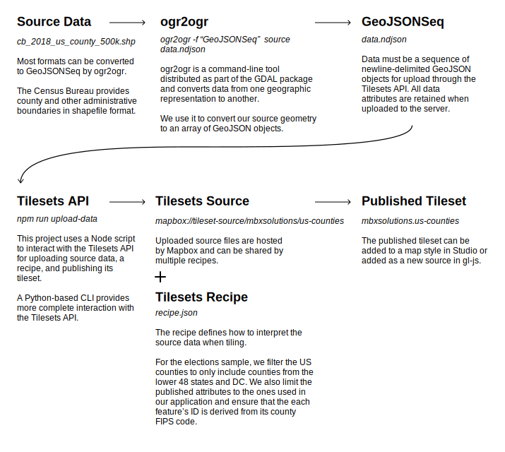
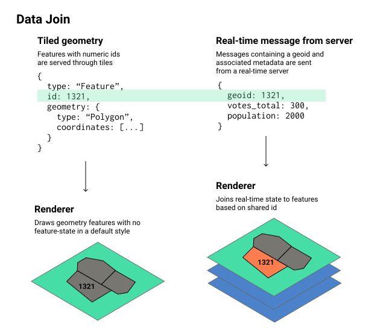

# Real-time mapping

This is a reference architecture for visualizing real-time data with Mapbox. It implements and explains the solution described on the [Real-time Mapping](https://www.mapbox.com/solutions/real-time-maps) page.

It includes an election-based example where counties are updated live with voter participation data sent from a server. The data for this example is based on historic election participation and is animated using simulated poll-closing times.

<!-- toc -->

- [Quick start](#quick-start)
- [Development](#development)
  * [Configuration](#configuration)
  * [Directory structure](#directory-structure)
  * [Data architecture](#data-architecture)
  * [Example process](#example-process)
    + [Upload the sample data to your own Mapbox account](#upload-the-sample-data-to-your-own-mapbox-account)
    + [Modify the sample to use your own data](#modify-the-sample-to-use-your-own-data)
      - [1) Create a tileset](#1-create-a-tileset)
      - [2) Use the tileset in a map style](#2-use-the-tileset-in-a-map-style)
      - [3) Use the style in the demo](#3-use-the-style-in-the-demo)
- [Using a custom front-end](#using-a-custom-front-end)
- [Deployment](#deployment)
- [Built with](#built-with)
  * [Mapbox APIs](#mapbox-apis)
- [Authors](#authors)
- [License](#license)
- [Acknowledgments](#acknowledgments)

<!-- tocstop -->

## Quick start

Add a valid [Mapbox access token](https://account.mapbox.com/access-tokens/) to your environment. Tokens can be added via your shell:

```shell
export REACT_APP_MAPBOX_TOKEN=<your Mapbox token>
```

Tokens can also be added to a `.env` file. See [`sample.env`](./sample.env) for an example of how to structure your `.env` file.

Once the environment is configured, install dependencies and start the application.

```shell
npm install
npm start
```

Your browser will open a page displaying a map of US counties. Over time, the counties change color as the server reports the number of votes cast in each county.



## Development

### Configuration

You need a recent version of [Node.js](https://nodejs.org/en/). This architecture was developed with Node 12.8.

You need an active [Mapbox account](https://account.mapbox.com/auth/signup/) and [access token](https://account.mapbox.com/access-tokens/).

### Directory structure

The code for this project is organized in three top-level directories.

```
client/     -- web front-end that joins tiled geometry and real-time data from the server
server/     -- SSE server that emits mock voter turnout data over time
data/       -- script for data upload, county boundary data, and election participation data
```

### Data architecture

Two sources of data need to be joined at runtime for the real-time visualization to work. One is the source geometry, which is served as tiles from Mapbox. The other is a sequence of real-time messages.


The source geometry goes through a series of transformations before being tiled. We first make sure that it has the attributes we care about and then format it as a GeoJSON sequence. Once uploaded, the Tilesets API lets us further filter the data and limit what is served in our tiles to only what our application needs.



At runtime, the client joins tiled geometry to live data streamed from a server and styles it based on their real-time values.

In order to join the two sources of data, the geometry needs a property that matches the real-time data from the server. For this application, we store the county FIPS code as the feature ID to use for runtime joining.

The data join happens by [setting the map's feature-state](./client/src/RealtimeMap.tsx#L99) whenever new data is received from the server.

```javascript
map.once("style.load", () => {
    subscription = electionData.subscribe(update => {
    if (update === RESET) {
        map.removeFeatureState({ source: "composite", sourceLayer: realtimeLayerID });
    } else {
        update.forEach(county => {
            const voteProportion = county.votes_total / county.population;
            if (county.geoid === "NA") {
                return;
            }
            // Assign the `voteProportion` feature-state to the source feature
            // whose ID matches the county's geoid
            map.setFeatureState(
                { source: "composite", sourceLayer: realtimeLayerID, id: county.geoid },
                { voteProportion }
            );
        });
    }
});
```

An [expression in the map's style object](./client/src/RealtimeMap.tsx#L57) determines how the feature-state is interpreted as a visual on the map.

```javascript
map.setPaintProperty(realtimeLayerID, "fill-color", [
    "case",
    ["!=", ["feature-state", "voteProportion"], null],
    // if we have turnout information for a feature, use it to interpolate a color
    [
        "interpolate",
        ["exponential", 2],
        // use the value of the `voteProportion` feature-state as an input
        ["feature-state", "voteProportion"],
        // color low turnout purple
        0.3,
        "rgba(127, 0, 200, 0.6)",
        // color high turnout bright green
        0.7,
        "rgba(0, 255, 80, 0.9)"
    ],
    // if there is no turnout information, use gray
    "rgba(127, 127, 127, 0.5)"
]);
```

Because the state and the style work in conjunction, the visual map updates in real-time whenever new data is received from the server and assigned to a value in feature-state.



### Example process

#### Upload the sample data to your own Mapbox account

You can upload the US county geometry and use it within your own account by following the steps outlined in the data [README](./data/README.md).

A typical geometry feature follows. It has many properties, like `STATE_NAME`, that we can use in our tilesets recipe for deciding when and how to include data in our tileset. We use the `GEOID` as the feature id in our tileset, which lets us connect the tiled data to our real-time information about each county.

```
{"type": "Feature", "properties": {"STATEFP": "21", "COUNTYFP": "007", "COUNTYNS": "00516850", "AFFGEOID": "0500000US21007", "GEOID": "21007", "NAME": "Ballard", "LSAD": "06", "ALAND": 639387454, "AWATER": 69473325, "STATE_NAME": "Kentucky"}, "geometry": {"type": "Polygon", "coordinates": [...]}}
```

#### Modify the sample to use your own data

To tile your own geometry for real-time data joining, do the following:

##### 1) Create a tileset

Use the Tilesets API to upload newline-delimited GeoJSON and publish a tileset.

##### 2) Use the tileset in a map style

Define a new map style in Mapbox Studio and add the tileset as a source for a layer. Style it as desired for visibility and size across relevant zoom levels. The default appearance should be appropriate for a "no data available" state.

##### 3) Use the style in the demo

Pass your [style URL](https://docs.mapbox.com/help/glossary/style-url/) as a prop to the RealtimeMap to test out your data. If it uses 2018 FIPS codes for the data join, it should work with the existing application.

## Using a custom front-end

To use a custom front-end, make sure you are loading a style with relevant source ids. Then configure the visuals and state updates based on your applications needs. The core tasks are adding a paint property that is controlled by feature state, subscribing to updates or polling for data about relevant features, and setting feature state on the map as real-time updates arrive.

## Deployment

For deployment, you will need access to a live data provider.

Map styles created with the Tilesets API and Mapbox Studio are production ready.

## Built with

### Mapbox APIs

- [Mapbox Studio](https://docs.mapbox.com/studio-manual/overview/)
    - Data previsualization
    - Map styling
- [Tilesets API](https://docs.mapbox.com/api/maps/#tilesets)
    - Data upload
    - Data filtering
    - Data tiling
- [Mapbox GL JS](https://docs.mapbox.com/mapbox-gl-js/api/)
    - Map rendering
    - Runtime data-join

### Third-party libraries

- [RXJS](https://rxjs.dev/)
- [React.js](https://reactjs.org/)
- [Express.js](https://expressjs.com/)

## Authors

This project was created by the Mapbox Solutions Architecture team.  
solutions_architecture@mapbox.com

## License

The code for this project is licensed under the BSD 3-Clause License - see the [LICENSE](./LICENSE.md) file for details.

For data licensing, see the [README in the data/ folder](./data/README.md).
